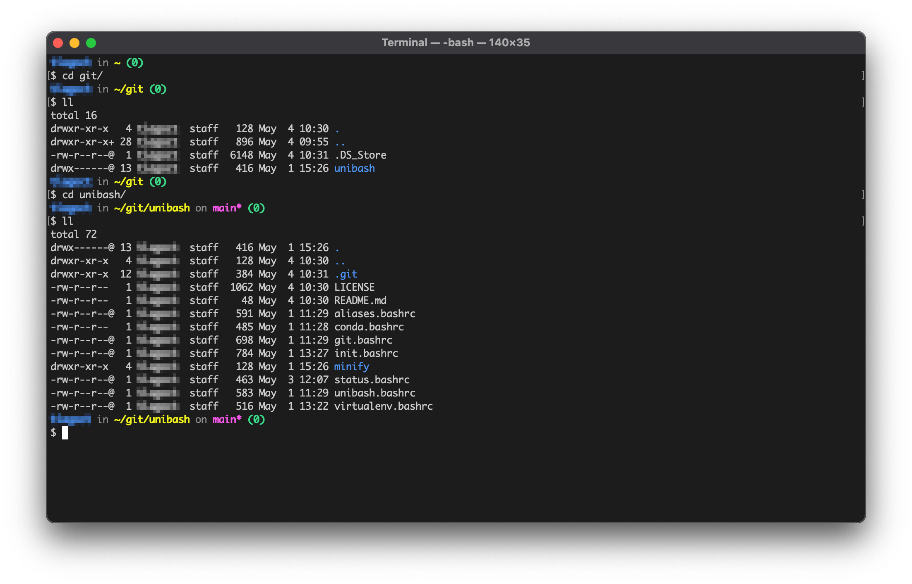

# unibash

The unibash project aims to be a minimal, clean and _easy-to-use_ bash prompt,
that's also FAST!

It includes various "plug-ins" out-of-the-box for common workflows or popular
tools, such as:

- Aliases

```bash
l       # List all files and folders, excluding hidden (.*)
ll      # List all files and folders, including hidden (.*)
lh      # List all files and folders, excluding hidden (.*), with human-readable sizes
llh     # List all files and folders, including hidden (.*), with human-readable sizes
```

- Python development, including support for `conda` and `venv`
- Git integration
- Status codes

### Requirements

To use this prompt, you should be running at least `Bash 4.x`. Later versions
are also supported. The unibash prompt has been tested on macOS and Linux
distributions.

### Demo



<p align="center">
(NOTE: username has been blurred.)
</p>

# Minifier

The unibash project is written as a collection of various individual files to
simplify development, but a minifier script is included to generate a flat
`.bashrc` file available under `minify/unibash.min.bashrc`. This file can be
used stand-alone in a "production" environment, with the added benefit that the
prompt will also load faster.

# Usage

To use unibash, clone the repository or download the code to a local directory,
for example, `~/git/unibash`.

Then, add the following to your `.bashrc` or `.bash_profile`:

```bash
# Enable unibash
if [ -f "${HOME}/git/unibash/minify/unibash.min.bashrc" ]; then
    source "${HOME}/git/unibash/minify/unibash.min.bashrc"
elif [ -f "${HOME}/git/unibash/unibash.bashrc" ]; then
    source "${HOME}/git/unibash/unibash.bashrc"
fi
```

# Extras

You can also add the following "extras" to your `.bashrc` file.

1. Configure bash history management

```bash
# Append bash commands to history
shopt -s histappend

# Configure history parameters
export HISTTIMEFORMAT='%F %T '
export HISTSIZE=10000
export HISTFILESIZE=10000
export HISTCONTROL=ignorespace:ignoredups
export HISTIGNORE='history:pwd:exit:'
```

2. Disable "last login" message and bash sessions

```bash
touch "${HOME}/.hushlogin"
touch "${HOME}/.bash_sessions_disable"
```

3. Set default editor

```bash
# Set default editor
export VISUAL=nano
export EDITOR=nano
```
